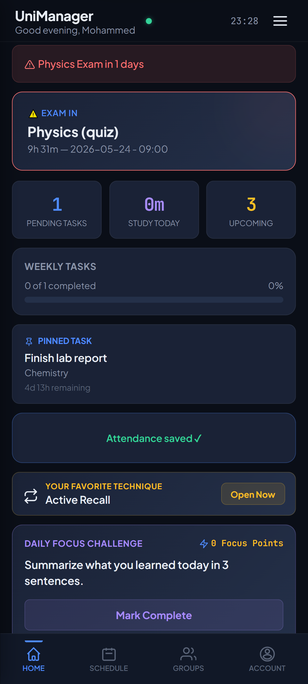
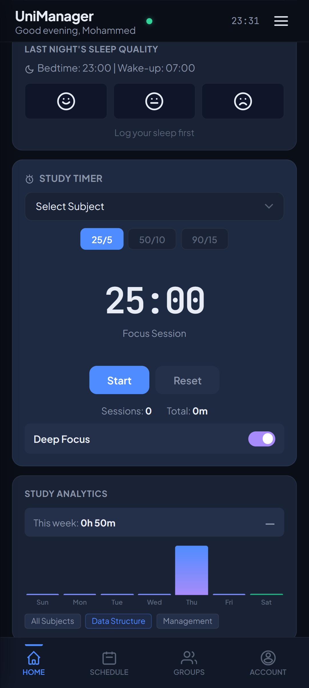
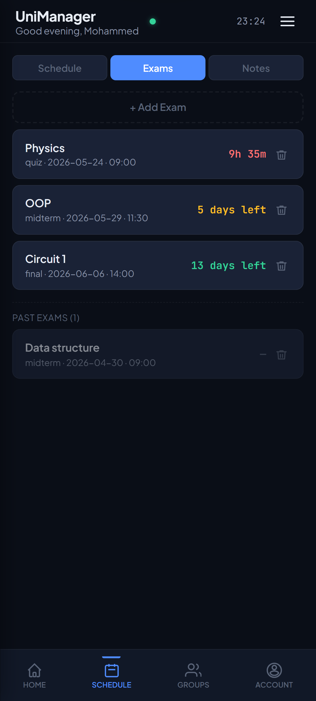
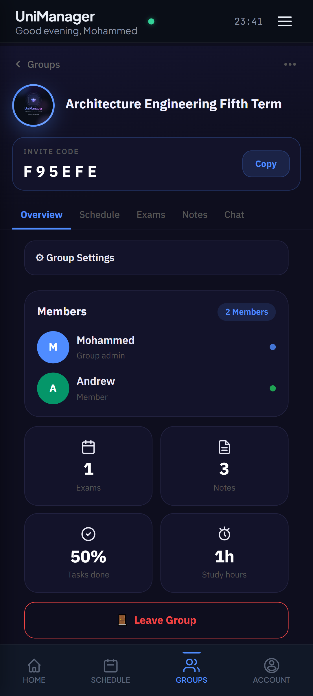
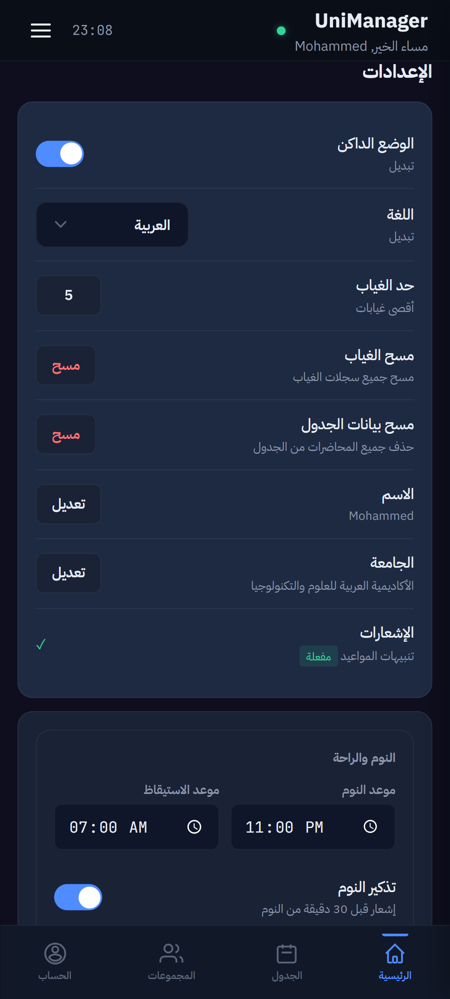
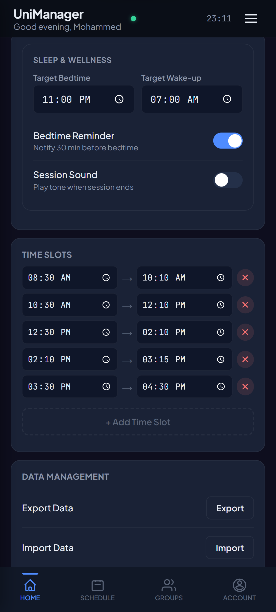
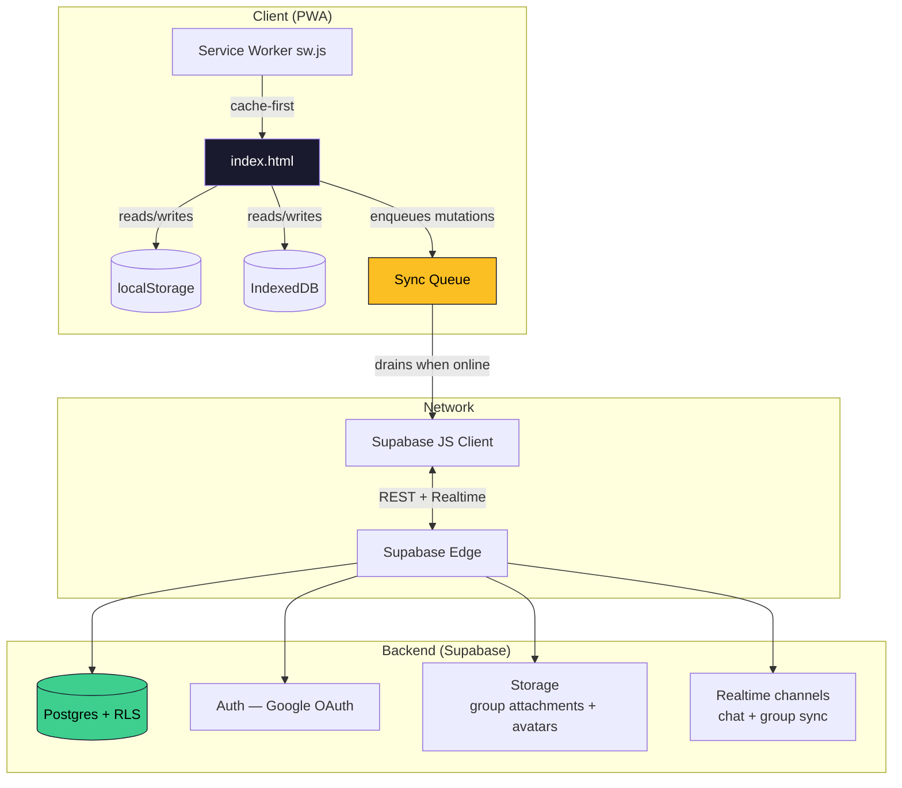

# UniManager

> An offline-first PWA that replaces the six different apps a university student juggles to survive a semester — schedule, GPA, exams, attendance, study tracking, and real-time group collaboration — in a single installable app. Built solo, no framework, no build step.

<p align="center">
  
  <!-- TODO: add docs/screenshots/hero.png -->
</p>

<p align="center">
  <a href="LICENSE"></a>
  <a href="#"></a>
  <a href="#"></a>
  <a href="#"></a>
  <a href="https://unimanager-sy.pages.dev/"></a>
</p>

---

## 🎬 Demo

<p align="center">
  
  <!-- TODO: add docs/demo.gif -->
</p>

🌍 **Live:** https://unimanager-sy.pages.dev/

📱 **Install on your phone:** open the live URL → "Add to Home Screen" (or the install prompt). Works fully offline after first load.

🤖 **Android:** packaged as a Trusted Web Activity (TWA) via PWABuilder — package `app.unimanager.twa`. Play Store submission in progress.

---

## 📑 Table of contents

- [What it does](#-what-it-does)
- [Why I built this](#-why-i-built-this)
- [The part I'm proudest of: the GPA engine](#-the-part-im-proudest-of-the-gpa-engine)
- [Screenshots](#-screenshots)
- [Tech stack & decisions](#-tech-stack--decisions)
- [Architecture at a glance](#-architecture-at-a-glance)
- [Running it locally](#-running-it-locally)
- [Project structure](#-project-structure)
- [Deployment](#-deployment)
- [What I learned](#-what-i-learned)
- [Roadmap](#-roadmap)
- [License](#-license)

---

## 🎯 What it does

UniManager is a single PWA that replaces the patchwork of Notes, Calendar, WhatsApp groups, and Excel sheets that most students juggle to get through a semester.

**Personal tools**

- 📅 **Weekly schedule** with lecture / practical / activity slot types, pulled from a per-university time-slot template
- 📊 **GPA calculator** with a 7-system grading engine — percentage, US 4.0 (±), US 4.3, US unweighted, Turkey 4.0, UK Honours classification, and the German inverted 1–5 scale (see [below](#-the-part-im-proudest-of-the-gpa-engine))
- 🎯 **Final-grade calculator** — "what do I need on the final to pass / hit an A?"
- 📝 **Per-subject notes**
- 📋 **Tasks & assignments** with due-date tracking
- ⏱️ **Pomodoro timer + study log** with per-subject analytics
- 😴 **Sleep tracker** with bedtime reminders
- 📉 **Attendance / absence tracking** per subject
- 🎓 **Study-techniques library** and a **daily focus challenge**

**Group features (collaborative)**

- 👥 **Shared groups** with invite codes — for course sections, project teams, or study buddies
- 🔄 **Synced schedules** — group lectures broadcast to all members
- 📌 **Shared exams** with countdown highlighting (urgent banner when an exam is < 7 days away)
- 💬 **Real-time chat** with **file attachments** (Supabase Storage) and admin / everyone permission modes
- 🛡️ **Per-group admin controls** — who can post, who can edit group info, who can change the group picture

**Platform features**

- 🌍 **Bilingual:** Arabic (RTL) ↔ English with proper layout flipping, full EN↔AR key parity
- 🌓 **Dark / Light themes** that respect `prefers-color-scheme` on first load
- 📡 **Offline-first:** every mutation writes locally first and queues to IndexedDB, draining when the connection returns
- 🏫 **Data-driven university catalog** — grading scale and time slots come from a Supabase `universities` table; users can add their own institution
- 📲 **Installable PWA** with custom splash, app icons, and an Android TWA build
- 🔐 **Auth:** Supabase Google OAuth with session persistence
- 🛰️ **Error tracking:** Sentry with PII scrubbing

---

## 💡 Why I built this

I'm a CS / Computer Engineering student at AASTMT in Lattakia, Syria. Partway through a semester I realized I was using:

- A phone calendar for lectures
- A WhatsApp group for "wait, when's the midterm again?"
- Excel for GPA projections
- A notes app for everything else

None of them talked to each other. The WhatsApp pinned message went stale by week 3. Half the class thought one midterm was Monday, half thought Wednesday. Someone failed.

So I started building the thing I wished existed: **one app, owned by the students who use it, with a shared schedule that can't go stale because everyone edits the same source of truth.**

What started as a personal schedule + GPA tool grew into a collaborative platform with real-time groups, a multi-country grading engine, and an Android build heading to the Play Store.

---

## 🧮 The part I'm proudest of: the GPA engine

Most student GPA apps hard-code a single grading scale. UniManager's grading is a **config-driven engine** that handles four fundamentally different *types* of computation, because grading systems across countries don't just differ in numbers — they differ in *what a result even is*.

The engine is defined by a single `GRADE_SYSTEMS` config object and read by `calcGPA` / `renderGPA`. Adding a country is a data change, not a code change.

| `type` | What you enter | What comes out | Systems |
|---|---|---|---|
| `percent` | A score 0–100 | Credit-weighted percentage average | Syria (`sy_percent`) |
| `letter` | A letter from that system's table | Credit-weighted GPA points | US 4.0± (`us_4`), US 4.3 (`us_4_3`), US unweighted (`us_4_unweighted`), Turkey 4.0 (`tr_4`) |
| `percent_banded` | A percentage | A **degree classification** (First / 2:1 / 2:2 / Third / Fail) | UK Honours (`uk_honours`) |
| `numeric_inverted` | A number 1.0–5.0 | Credit-weighted average where **lower is better** | Germany (`de_1_5`) |

That last column is the interesting part:

- **UK Honours** doesn't produce a number you compare directly — it produces a *classification band*. The engine computes the credit-weighted average percentage and maps it through a band table. (This is the simplified credit-weighted model; it deliberately omits per-institution year-weightings, which vary too much to generalize.)
- **The German scale is inverted** — 1.0 is the best grade, 5.0 is a fail. Every "higher is better" assumption in the rest of the app has to be flipped for this one system, and the UI labels the result accordingly.

The system in use is resolved by a small precedence chain (`activeGradeSystemId`): an explicit user choice wins, otherwise it's derived from the selected university, otherwise it falls back to Syrian percentage. The legacy single-scale functions (`LG`, `l2g`, `getLG`, `s2g`, `isPassing`) are kept as thin backward-compat wrappers so old saved data still renders.

This is the subsystem I'd most want to talk through in an interview — it's where "just build a calculator" turned into a small modeling problem.

---

## 📸 Screenshots

> <!-- TODO: confirm these screenshot files exist in docs/screenshots/ before relying on them in a portfolio link -->

<table>
  <tr>
    <td></td>
    <td></td>
    <td></td>
  </tr>
  <tr>
    <td align="center"><sub>Home — Stats & Progress</sub></td>
    <td align="center"><sub>Home — Pomodoro & Analytics</sub></td>
    <td align="center"><sub>Weekly Schedule</sub></td>
  </tr>
  <tr>
    <td></td>
    <td></td>
    <td></td>
  </tr>
  <tr>
    <td align="center"><sub>Exam Countdowns</sub></td>
    <td align="center"><sub>GPA Calculator</sub></td>
    <td align="center"><sub>Groups — Members & Stats</sub></td>
  </tr>
  <tr>
    <td></td>
    <td></td>
    <td></td>
  </tr>
  <tr>
    <td align="center"><sub>Groups — Real-time Chat</sub></td>
    <td align="center"><sub>Settings — General</sub></td>
    <td align="center"><sub>Settings — Data & Time Slots</sub></td>
  </tr>
</table>

---

## 🛠 Tech stack & decisions

| Layer | Choice | Why |
|---|---|---|
| **Frontend** | Vanilla JS, single `index.html` (~7,500 lines) | No build step → instant deploy, zero npm vulnerabilities, fully reproducible. The whole app is one Service-Worker-cacheable file. |
| **Styling** | Hand-written CSS with custom properties | Every design token (`--bg-primary`, `--accent`, `--radius`, …) flows from `:root`. Theme switching is one attribute toggle. |
| **Backend** | [Supabase](https://supabase.com) (Postgres + Auth + Realtime + Storage) | Free tier covers a class of students, RLS handles permissions in SQL where they belong, and the JS client is one CDN script tag. |
| **Offline** | IndexedDB via a custom `IDB` wrapper + a FIFO sync queue | Every mutation writes locally first, then enqueues a Supabase op. When the user comes back online, the queue drains in order. |
| **PWA** | Hand-rolled `sw.js` + `manifest.json` | I wanted to understand exactly what gets cached and when. Cache-first (stale-while-revalidate) for static assets, network-first for Supabase. |
| **Auth** | Supabase **Google OAuth** (`flowType: 'implicit'`) | Sessions persist across reloads. The OAuth redirect's `#access_token` is captured via `detectSessionInUrl` and the URL is cleaned after sign-in. |
| **i18n** | A large `LL` object with `en` and `ar` dictionaries | Every string is in one place, reviewable in one diff. `t()` warns once per missing key so EN↔AR parity never silently drifts. |
| **Android** | TWA via PWABuilder | One package (`app.unimanager.twa`) wrapping the same PWA. `assetlinks.json` deployed for verified app links. |
| **Observability** | Sentry (browser SDK, PII scrubbed) | Loaded before the main script so early crashes are still captured. |
| **CI/CD** | GitHub Actions | Version-lockstep check, Lighthouse budget, and deploy. |
| **Hosting** | **Cloudflare Pages** | Migrated off GitHub Pages → Netlify → Cloudflare. The repo IS the deployment. |

### Decisions I'd defend in an interview

**Why a single HTML file?**
This app gets installed on phones with weak CPUs and spotty mobile data. A single file parses faster than a webpack bundle on a low-end Android device, and the Service Worker can cache the entire app shell *atomically* — there's no partial-update window where a new `index.html` is paired with a stale chunk. No code-splitting bugs, no hydration mismatches, no "works on my machine but the build broke in CI." It's a deliberate trade-off for the target hardware, not an accident — and the [Architecture doc](docs/ARCHITECTURE.md) is honest about where the trade-off starts to hurt.

**Why offline-first with a sync queue instead of just refetching?**
University Wi-Fi goes down constantly. A student needs to log a grade *now*, before they forget the question they got wrong. Optimistic write + queue + retry handles this without the user ever thinking about networks.

**Why a data-driven university catalog instead of hard-coded scales?**
Hard-coding one university's grading meant the app only worked for me. Moving universities (and their grade systems + time slots) into a `universities` table — official rows visible to everyone, user-submitted rows private to their creator via RLS — turned "my app" into "an app any student in four countries can use," and let me ship an "add your own university" flow without a deploy.

**Why Supabase over Firebase?**
Real SQL and JOINs for inherently relational data (a student ↔ their courses ↔ grades ↔ attendance). RLS policies I can read and version-control. No vendor-locked query language, and a one-command Postgres export if I ever need to leave. The reasoning is laid out in full in the [Architecture doc](docs/ARCHITECTURE.md#4-why-supabase).

---

## 🏗 Architecture at a glance

A full technical deep-dive — sync engine, conflict resolution, RLS policies, threat model, scale boundaries — lives in **[docs/ARCHITECTURE.md](docs/ARCHITECTURE.md)**. The short version:



**The data-flow model in three sentences:**

1. Every state mutation writes to the in-memory `state` object → mirrored to `localStorage` (synchronous) and IndexedDB (async).
2. If the mutation belongs to a cloud-synced entity, it's also enqueued; the queue drains immediately, or retries on the next `online` event / app boot if it fails.
3. Realtime subscriptions push other users' changes into the same `state` object via the same code path — so the UI doesn't care whether a change came from the user or the network.

---

## 🚀 Running it locally

```bash
git clone https://github.com/andrewleko19-boop/unimanager.git
cd unimanager

# Serve over a real origin (Service Workers + OAuth won't work from file://)
npx serve .
# or
python3 -m http.server 8000
```

Then open `http://localhost:8000`.

### Point it at your own Supabase backend (optional)

The app talks to a hosted Supabase project. To run your own:

1. Create a project at https://supabase.com (free tier is enough).
2. Run `unimanager_database_schema.sql` against your project (SQL Editor). This creates the tables, RLS policies, and the universities seed.
   > ⚠️ The schema file does **not** recreate the group RPC functions (`create_group`, `join_group_by_code`, etc.) or the Storage bucket policies — their signatures are documented in the file but the bodies live only in Supabase. You'd need to recreate those separately.
3. Enable **Google** under Authentication → Providers, and set your Site URL + redirect URLs.
4. In `index.html`, replace the Supabase URL and anon key in the client init.
5. Update the `connect-src` (and Sentry hosts, if used) in the CSP `<meta>` tag to match your project.

The anon key is safe to ship — RLS enforces all access control server-side.

---

## 📁 Project structure

The repo is intentionally flat. I considered splitting `index.html` into modules but kept it single-file because:

1. The Service Worker caches one file → atomic version updates, no partial-state window.
2. CI/CD has nothing to build → no toolchain to maintain.
3. The whole app is readable top-to-bottom in one editor tab.

Inside `index.html`, the code is divided by banner comments — `Ctrl+F` the banner to jump:

```js
/* ===== APP VERSION ===== */
/* ===== SECURITY: HTML ESCAPE ===== */
/* ===== i18n ===== */
/* ===== DATA ===== */          // GRADE_SYSTEMS, university fallbacks
/* ===== STATE ===== */         // defaultState / loadState / saveState
/* ===== GPA / GPA HISTORY ===== */
/* ===== SCHEDULE / EXAMS / TASKS ===== */
/* ===== POMODORO / SLEEP / STUDY ===== */
/* ===== SETTINGS ===== */
/* ===== INIT ===== */
// SupaDB + IDB (sync queue, auth, groups, storage) live in the
// large script block toward the end of the file.
```

```
unimanager/
├── index.html                       # The whole app — UI, logic, styles (~7,500 lines)
├── sw.js                            # Service Worker (stale-while-revalidate static, bypass for Supabase)
├── manifest.json                    # PWA manifest (theme, icons, display: standalone)
├── unimanager_database_schema.sql   # Tables + RLS + universities seed (NOT the RPCs/storage policies)
├── icons/                           # PWA + iOS icons and splashes
├── .github/workflows/               # CI: version lockstep, Lighthouse, deploy
└── docs/
    ├── ARCHITECTURE.md              # Deep-dive: sync, RLS, conflict resolution, threat model
    └── screenshots/
```

---

## 🚢 Deployment

**Pushing changes:**

1. Bump `APP_VERSION` in `index.html`.
2. Bump `CACHE_VERSION` in `sw.js` **to the same value**.
3. Push to `main` — Cloudflare Pages picks up the commit automatically.

> ⚠️ **The two versions must change together.** The Service Worker only invalidates its caches when `CACHE_VERSION` changes; CI's version check fails the build if they don't match. Forget, and returning users keep seeing the old app indefinitely.

```bash
grep -oE "APP_VERSION = '[^']+'" index.html
grep -oE "CACHE_VERSION = '[^']+'" sw.js
# confirm both match, then:
git add index.html sw.js
git commit -m "…"
git push origin main
```

After deploy, test on the live `pages.dev` URL: DevTools → Application → Clear site data → unregister the Service Worker → hard reload, then confirm the splash shows the expected version.

---

## 📚 What I learned

In rough order of "things I understand now that I didn't when I started":

- **Service Worker lifecycle is genuinely subtle.** A cached SW can keep serving a stale `index.html` for days if you don't bump the cache key. The lockstep version check exists because I got burned by this.
- **CSP from the start saves hours.** Supabase Realtime opens a WebSocket to a different origin, and Sentry posts to yet another — if the CSP doesn't list them explicitly, you get silent failures that look like bugs in your own code.
- **Offline UX changes how you design every feature.** Once the optimistic-update + queue-and-retry pattern clicked, I started every feature from "what if this *never* reaches the server?" — which, counterintuitively, made the online path simpler too.
- **Postgres RLS is a force multiplier.** Write the permission check once, in SQL, and every client gets it for free. The hard part is avoiding recursive policies — cross-table inline subqueries in a policy can infinite-loop, which is why group access goes through `SECURITY DEFINER` helper functions.
- **Modeling beats hard-coding.** The GPA engine started as a percentage calculator and became a four-type modeling problem. The version that handles UK classifications and the inverted German scale is barely more code than the naive version would have been — because the data drives the behavior.
- **i18n is harder than translating strings.** Direction (RTL/LTR), date formats on Arabic-locale devices, and flexbox layouts that double-flip under `dir="rtl"` are all real bugs I hit.
- **READMEs are read by the people who decide whether to interview you.** This document and the architecture doc took real time. For a portfolio project, that time is worth more than another feature.

---

## 🗺 Roadmap

### Shipped

- [x] Offline-first sync queue (IndexedDB, FIFO drain, retry on reconnect)
- [x] Bilingual UI (Arabic + English, full RTL, key-parity safety net)
- [x] 7-system, 4-type GPA engine + data-driven university catalog
- [x] Groups: shared schedule + exams + notes + real-time chat with file attachments
- [x] Google OAuth + session persistence
- [x] Sentry error tracking (PII scrubbed)
- [x] CI: version-lockstep check + Lighthouse budget + deploy
- [x] PWA splash + icons; Android TWA package built (`app.unimanager.twa`)

### Next

- [ ] **Google Play release** — AAB + `assetlinks.json` are done; blocked on the Play Console fee, the 20-tester / 14-day closed-testing requirement for new individual accounts, adding Play App Signing's SHA-256 to `assetlinks.json`, and the Privacy Policy + Data-safety form.
- [ ] Push notifications for upcoming exams (the SW already handles `push` / `notificationclick`).
- [ ] Edit / delete a user-added university (currently add-only).
- [ ] Unit tests for the GPA engine and sync-queue ordering.
- [ ] Chat history pagination beyond the current load cap.

### Possible v2 — *selective extraction, not a rewrite*

If this grows past a single semester's worth of features, the move is **not** "throw it all out and start over in React" — rewrites are where projects go to die. The plan is surgical: extract the **sync queue + state layer into a typed, independently testable module** (the one part where immutable, type-checked state would genuinely reduce bugs), and leave the rest of the single-file app alone until there's a concrete reason to touch it. The current build stays the production target for the low-end devices it was designed for.

---

## 📄 License

Proprietary — All rights reserved. See [`LICENSE`](LICENSE).

The source is public for portfolio and code-review purposes. Copying, redistributing, or republishing the app (including on app stores) requires prior written permission from the author.

---

## 👨‍💻 About the author

**Mohamed Hassan**
CS / Computer Engineering student @ AASTMT, Lattakia, Syria
🐙 [@andrewleko19-boop](https://github.com/andrewleko19-boop)

Building toward strong fundamentals in systems, performance, and shipping real software end-to-end. If you're hiring interns / new-grads, I'd love to chat.