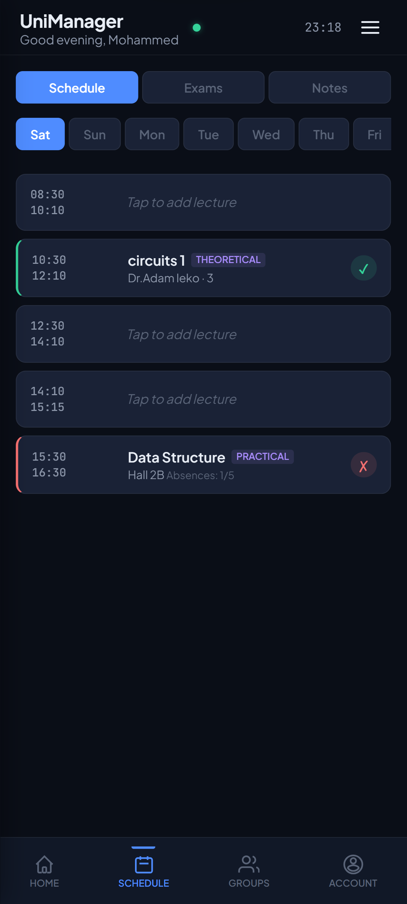
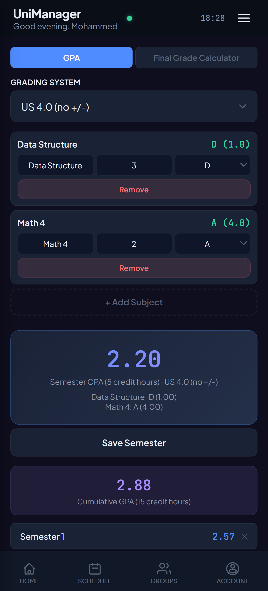
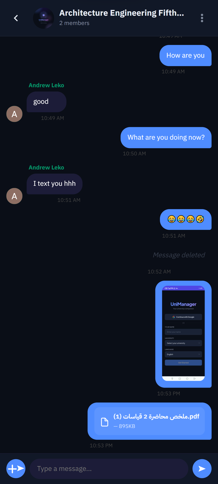
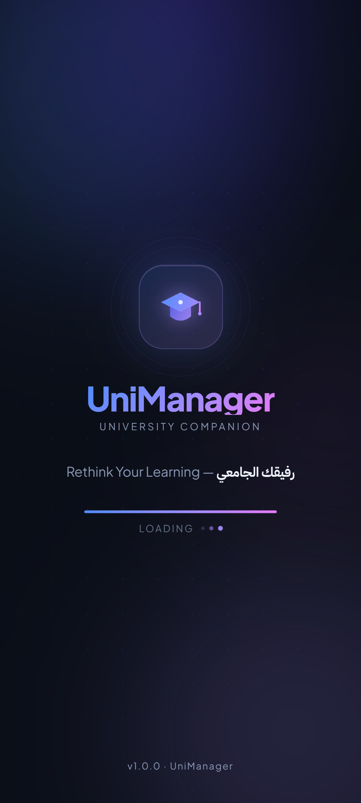
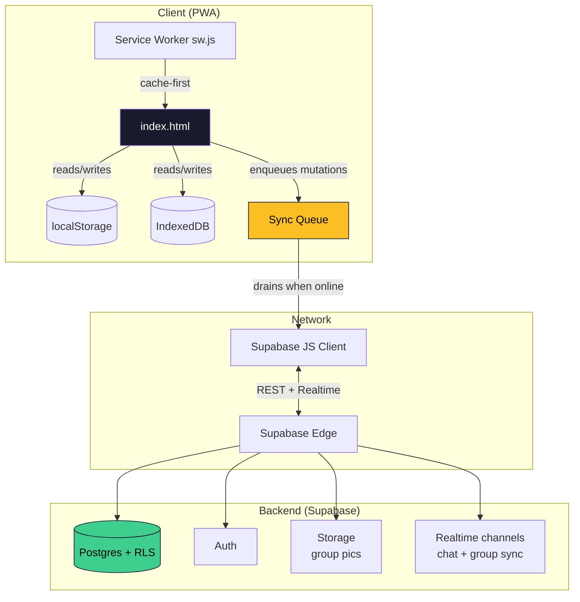

# UniManager

> A single-file, offline-first PWA that acts as a complete companion for university students — schedule, GPA, exams, notes, and group collaboration. Built solo by a CS student who got tired of juggling 6 different apps.

<p align="center">
  
</p>

<p align="center">
  <a href="#"></a>
  <a href="#"></a>
  <a href="#"></a>
  <a href="#"></a>
  <a href="https://andrewleko19-boop.github.io/unimanager/"></a>
</p>

---

## 🎬 Demo

<p align="center">
  
</p>

🌍 **Live:** https://andrewleko19-boop.github.io/unimanager/

📱 **Install on your phone:** open the live URL → "Add to Home Screen". Works fully offline after first load.

---

## 📑 Table of contents

- [What it does](#-what-it-does)
- [Why I built this](#-why-i-built-this)
- [Screenshots](#-screenshots)
- [Tech stack & decisions](#-tech-stack--decisions)
- [Architecture](#-architecture)
- [Running it locally](#-running-it-locally)
- [Project structure](#-project-structure)
- [Deployment](#-deployment)
- [What I learned](#-what-i-learned)
- [Roadmap](#-roadmap)
- [License](#-license)

---

## 🎯 What it does

UniManager is a single PWA that replaces the patchwork of Notes, Calendar, WhatsApp groups, and Excel sheets that most CS students juggle to survive a semester.

**Personal tools**

- 📅 **Weekly schedule** with lecture/practical/activity slot types and clash detection
- 📊 **GPA calculator** with local university grading scales (4.0 / 5.0 / percentage)
- 🎯 **Final-grade calculator** — "what do I need on the final to pass / hit an A?"
- 📝 **Per-subject notes** with markdown-ish formatting
- 📋 **Tasks & assignments** with due-date tracking
- 🎓 **Skills tracker** for self-study progress outside coursework

**Group features (collaborative)**

- 👥 **Shared groups** with invite codes — for course sections, project teams, or study buddies
- 🔄 **Synced schedules** — group lectures auto-broadcast to all members
- 📌 **Shared exams** with countdown highlighting (the urgent banner triggers when an exam is < 7 days away)
- 💬 **Real-time chat** with admin/everyone permission modes
- 🛡️ **Per-group admin controls** — who can post, who can edit info, who can change the group picture

**Platform features**

- 🌍 **Bilingual:** Arabic (RTL) ↔ English with proper layout flipping
- 🌓 **Dark / Light themes** that respect `prefers-color-scheme` on first load
- 📡 **Offline-first:** every action queues to IndexedDB and syncs when connection returns
- 📲 **Installable PWA:** custom splash, app icons, native-feeling navigation, no browser chrome
- 🔐 **Auth:** Supabase email/password with session persistence

---

## 💡 Why I built this

I'm a CS student at AASTMT in Egypt. Halfway through the spring 2026 semester I realized I was using:

- iOS Calendar for lectures
- A WhatsApp group for "wait when's the midterm again?"
- Excel for GPA projections
- Apple Notes for everything else
- A Telegram bot some senior wrote that breaks every two weeks

None of them talked to each other. The WhatsApp group's pinned message went stale by week 3. Half the class thought the OS midterm was Monday, half thought Wednesday. Someone failed.

So I started building the thing I wished existed: **one app, owned by the students who use it, with a shared schedule that can't go stale because everyone edits the same source of truth.**

Six weeks of late nights later, here we are.

---

## 📸 Screenshots

<table>
  <tr>
    <td></td>
    <td></td>
    <td></td>
    <td></td>
  </tr>
  <tr>
    <td align="center"><sub>Home dashboard</sub></td>
    <td align="center"><sub>Weekly schedule</sub></td>
    <td align="center"><sub>GPA calculator</sub></td>
    <td align="center"><sub>Group overview</sub></td>
  </tr>
  <tr>
    <td></td>
    <td></td>
    <td></td>
    <td></td>
  </tr>
  <tr>
    <td align="center"><sub>Group chat with permissions</sub></td>
    <td align="center"><sub>Shared exams + countdown</sub></td>
    <td align="center"><sub>Full Arabic RTL support</sub></td>
    <td align="center"><sub>Animated splash screen</sub></td>
  </tr>
</table>

---

## 🛠 Tech stack & decisions

| Layer | Choice | Why |
|---|---|---|
| **Frontend** | Vanilla JS, single `index.html` | No build step → instant deploy, zero npm vulnerabilities, fully reproducible. The whole app fits in one Service-Worker-cacheable file. |
| **Styling** | Hand-written CSS with custom properties | ~3000 lines, but every design token (`--bg-primary`, `--accent`, `--radius`, …) flows from `:root`. Theme switching is one attribute toggle. |
| **Backend** | [Supabase](https://supabase.com) (Postgres + Auth + Realtime + Storage) | Free tier covers a class of students, RLS policies handle permissions in SQL where they belong, and the JS client is one CDN script tag. |
| **Offline** | IndexedDB via custom `IDB` wrapper + a sync queue | Every mutation writes locally first, then enqueues a Supabase op. When the user comes back online, the queue drains in order. |
| **PWA** | Hand-rolled `sw.js` + `manifest.json` | I wanted to understand exactly what gets cached and when. The SW uses cache-first for static assets and network-first for Supabase requests. |
| **Auth** | Supabase email/password | Sessions persist across reloads via `localStorage`. The splash screen blocks the `welcomeScreen` flash for returning users by peeking the session before rendering anything. |
| **i18n** | A 700-line `LL` object with `en` and `ar` | Overkill? Maybe. But every string is in one place, reviewable in one diff, and adding a new language is mechanical. |
| **Hosting** | GitHub Pages + GitHub Actions auto-deploy | $0/month. The repo IS the deployment. |

### Decisions I'd defend in an interview

**Why a single HTML file?**
The real reason: I wanted to learn what's actually possible without a framework. The practical reason: this app is going to be installed on phones with weak CPUs and spotty 3G. A single 420KB file (140KB gzipped) parses faster than a webpack bundle on a Galaxy A12. No code-splitting bugs, no hydration mismatches, no "works on my machine but the build broke on Vercel."

**Why offline-first with a sync queue instead of just refetching?**
University Wi-Fi goes down all the time. Students need to log a grade NOW, before they forget the question they got wrong. Queue + retry handles this without the user thinking about networks.

**Why no React/Vue/Svelte?**
For this size of app, vanilla DOM manipulation is shorter and more transparent than the framework boilerplate would have been. (For UniManager v2 — see [Roadmap](#-roadmap) — I'm migrating to React + TS specifically because the offline sync logic is now complex enough that immutable state would help.)

**Why Supabase over Firebase?**
Real SQL. RLS policies that I can read and version-control. No vendor-locked query language. Free tier is generous enough that the whole class can use it.

---

## 🏗 Architecture



### The data-flow model in three sentences

1. Every state mutation writes to the in-memory `state` object → mirrored to `localStorage` (synchronous) and IndexedDB (async).
2. If the mutation belongs to a group/cloud-synced entity, it also gets enqueued. The queue tries to drain immediately; if it fails, it retries with exponential backoff next time the app boots or the network event fires.
3. Realtime subscriptions push other users' changes into the same `state` object via the same code path, so the UI doesn't care whether a change came from the user or the network.

### Key files

```
unimanager/
├── index.html           # The whole app — UI, logic, styles
├── sw.js                # Service Worker (cache-first static, network-first API)
├── manifest.json        # PWA manifest (theme color, icons, display: standalone)
├── icons/               # PWA icons + iOS startup splashes
│   ├── icon-192.png
│   ├── icon-512.png
│   ├── apple-touch-icon-180.png
│   └── apple-touch-startup-image-*.png   # 12 sizes for iPhone/iPad
└── docs/
    ├── ARCHITECTURE.md   # Deep-dive on sync queue, RLS, threat model
    └── screenshots/
```

---

## 🚀 Running it locally

```bash
# Clone
git clone https://github.com/andrewleko19-boop/unimanager.git
cd unimanager

# Serve — any static server works. I use:
npx serve .
# or
python3 -m http.server 8000
```

Then open `http://localhost:8000` (not `file://` — Service Workers and Supabase auth need a real origin).

### Configure your own Supabase backend (optional)

The app ships with a public demo backend, but if you want your own:

1. Create a project at https://supabase.com (free tier is enough)
2. Run the SQL migrations in `db/migrations/` against your project
3. Enable Email auth in Authentication → Providers
4. Open `index.html` and replace:
   ```js
   const SUPA_URL = 'https://YOUR-PROJECT.supabase.co';
   const SUPA_KEY = 'YOUR-ANON-KEY';
   ```
5. Update the `connect-src` directive in the CSP `<meta>` tag (line 6) to point at your project URL

The anon key is safe to ship — RLS policies enforce all access control on the server side.

---

## 📁 Project structure

The repo is intentionally flat. I considered splitting `index.html` into modules but decided against it because:

1. The SW caches a single file → atomic version updates.
2. CI/CD has nothing to build → no toolchain to maintain.
3. Anyone can read the entire app top-to-bottom in one editor tab.

Inside `index.html`, the file is divided by big banner comments:

```js
/* ===== APP VERSION ===== */
/* ===== SECURITY: HTML ESCAPE ===== */
/* ===== STATE & PERSISTENCE ===== */
/* ===== I18N ===== */
/* ===== AUTH & SUPABASE CLIENT ===== */
/* ===== SYNC QUEUE ===== */
/* ===== PAGES: HOME / SCHEDULE / GPA / GROUPS / ... ===== */
/* ===== INIT ===== */
```

Find with `Cmd+F` on the banner. It works.

---

## 🚢 Deployment

**Pushing changes:**

1. Bump `APP_VERSION` in `index.html`
2. Bump `CACHE_VERSION` in `sw.js`
3. Push to `main` — GitHub Pages picks up the new commit within ~1 minute

> ⚠️ **Both versions must change together.** The Service Worker only invalidates its caches when `CACHE_VERSION` changes. If you forget, returning users will keep seeing the old app.

---

## 📚 What I learned

In rough order of "things I now understand that I didn't six weeks ago":

- **Service Worker lifecycle** is genuinely subtle. A cached SW can keep serving a stale `index.html` for days if you don't bump the cache key. I learned this the painful way and now have it tattooed on my forearm metaphorically.
- **CSP from the start** saves so much pain. Supabase realtime opens a WebSocket to a different origin — if your CSP doesn't list it explicitly, you'll spend an hour debugging a silent failure.
- **Offline UX > online UX.** Once the optimistic-update + queue-and-retry pattern clicked, every feature became easier to design because I started with "what if this never reaches the server?" instead of "what if it does?"
- **Postgres RLS is a superpower.** I write the permission check once, in SQL, and every client across all platforms gets it for free. No more "but did we add the auth check on the new endpoint?"
- **i18n is hard.** Direction (RTL/LTR), date formats, plurals, *and* the fact that some flexbox layouts double-flip when you naively add `flex-direction: row-reverse` to a `dir="rtl"` element. Real bug, took an hour to find.
- **PWA splash screens are deceptively complex.** Android pulls from `manifest.json`. iOS needs a separate `<link rel="apple-touch-startup-image">` for *every* device size. There's no spec mandate to keep these in sync. I have a script in `tools/` that generates all 12.
- **Recruiters look at READMEs.** This document took me a day. It's worth more than another feature.

---

## 🗺 Roadmap

### v1.x (current — single-file PWA)

- [x] Offline-first sync queue
- [x] Bilingual UI (Arabic + English)
- [x] Group schedules + chat + exams
- [x] PWA splash + iOS startup images
- [ ] Push notifications for upcoming exams
- [ ] Home Screen widget (PWA 2025 spec)
- [ ] Sentry integration for error tracking
- [ ] CI: lint + Lighthouse budget on every PR
- [ ] 10+ unit tests for sync queue & state sanitization

### v2 (planned — full rewrite)

A clean Vite + React + TypeScript port. Same features, real architecture:

- Component library extracted from current CSS (storybook'd)
- TanStack Query for server state, Zustand for client state
- The sync queue as a typed, testable module
- Per-route code splitting (the GPA calculator doesn't need the chat code loaded)
- Vitest + Playwright covering the critical paths

The current single-file version isn't going anywhere — it'll stay deployed at `/v1/` for the lightweight-device users who are the original target audience.

---

## 🤝 Contributing

This is currently a solo learning project, so I'm not actively seeking contributions. But if you find a bug or have an idea, **issues are very welcome** — open one and I'll respond within a couple of days.

If you're a fellow AASTMT student and want to fork this for your own batch, go for it. Drop a star and (optionally) tell me you're using it — I'd love to see how it gets adapted.

---

## 📄 License

MIT — see [`LICENSE`](LICENSE).

You can use, modify, and ship this for any purpose, commercial or otherwise. Attribution is appreciated but not required.

---

## 👨‍💻 About the author

**Mohamed Hassan**
CS student @ AASTMT, Cairo, Egypt
🐙 [@andrewleko19-boop](https://github.com/andrewleko19-boop)

Currently learning: distributed systems, performance engineering, and the art of saying no to scope creep.

If you're hiring interns / new-grads for 2027 onward, I'd love to chat.
