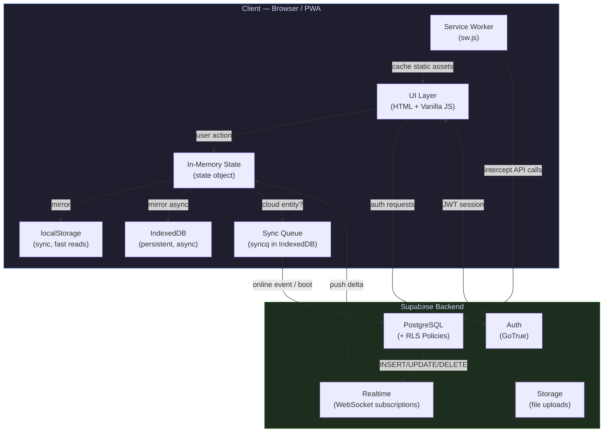
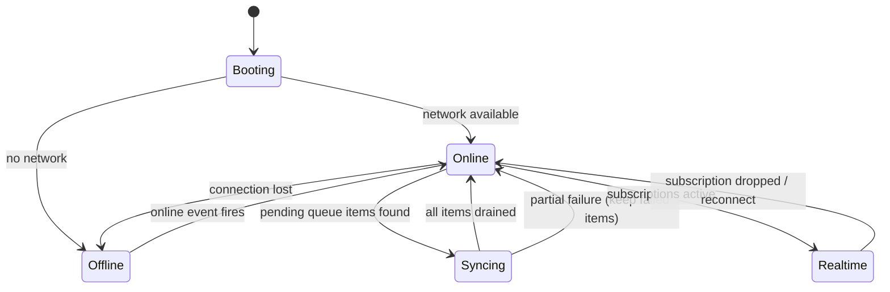

# UniManager — Architecture Deep Dive

> A technical internals guide covering the sync engine, offline-first model, conflict resolution, RLS policies, threat model, and PWA lifecycle. Written by the developer, for any engineer (or future me) who needs to understand *why* things are built the way they are.

---

## Table of Contents

1. [Project Overview](#1-project-overview)
2. [System Architecture Diagram](#2-system-architecture-diagram)
3. [Tech Stack](#3-tech-stack)
4. [Why Supabase?](#4-why-supabase)
5. [Sync Queue — How It Actually Works](#5-sync-queue--how-it-actually-works)
6. [Conflict Resolution — The Shared Exam Scenario](#6-conflict-resolution--the-shared-exam-scenario)
7. [Scale Boundaries](#7-scale-boundaries)
8. [Security Threat Model](#8-security-threat-model)
9. [The Decision I Regret](#9-the-decision-i-regret)
10. [Roadmap](#10-roadmap)
11. [What I Learned](#11-what-i-learned)
12. [Useful Links](#12-useful-links)

---

## 1. Project Overview

**UniManager** is a Progressive Web App (PWA) built to solve a real problem: managing university life — schedules, grades, attendance, group coordination, and a shared chat — in a single installable app that works offline.

| Property | Value |
|---|---|
| Type | Single-file PWA (Monolith) |
| Codebase | ~6,000 lines, `index.html` |
| Backend | Supabase (PostgreSQL + Auth + Realtime + Storage) |
| Offline | Full offline support via IndexedDB + Service Worker |
| Auth | Supabase Auth (email/password) |
| Deployment | GitHub Pages (static hosting) |
| Developer | Mohamed Hassan — CS student, AASTMT |

### Data-Flow Model

Every state mutation follows a strict three-step path:

1. **Local-first write** → The in-memory `state` object is updated immediately. This is then mirrored to `localStorage` (synchronous) and IndexedDB (async).
2. **Queue or sync** → If the mutation belongs to a cloud-synced entity (group message, exam, attendance), it gets enqueued. The queue drains immediately if the network is available; otherwise it retries on the next `online` event or app boot.
3. **Realtime merge** → Supabase Realtime subscriptions push other users' changes into the same `state` object via the same code path. The UI has no concept of "where" a change came from — it just re-renders.

### Project Structure

```
unimanager/
├── index.html              # The entire app — HTML, CSS, JavaScript (~6,000 lines)
├── sw.js                   # Service Worker: cache-first for static, network-first for API
├── manifest.json           # PWA manifest (theme, icons, display: standalone)
├── icons/                  # PWA icons + iOS splash screens
├── .github/
│   └── workflows/          # CI/CD pipelines (lint, validate, deploy)
├── docs/
│   ├── ARCHITECTURE.md     # This document
│   └── screenshots/
├── tools/                  # Dev tooling scripts
├── package.json
└── lighthouserc.cjs        # Lighthouse CI config
```

---

## 2. System Architecture Diagram



### Offline State Machine



---

## 3. Tech Stack

### Frontend

| Layer | Choice | Reason |
|---|---|---|
| Language | Vanilla JavaScript (ES2022) | No build step needed; PWA served as static HTML |
| Styling | CSS custom properties + BEM | Zero dependencies; full control |
| Offline storage | IndexedDB (raw API) | Persistent, async, handles large structured data |
| Fast reads | `localStorage` | Synchronous; used for state hydration on boot |
| PWA runtime | Service Worker (`sw.js`) | Cache-first static, network-first for Supabase API calls |
| PWA manifest | `manifest.json` | Enables "Add to Home Screen", standalone display mode |

### Backend (Supabase)

| Service | Usage |
|---|---|
| PostgreSQL | Primary database — schedules, grades, attendance, groups, chat |
| Row-Level Security (RLS) | Authorization layer — enforced at DB level, not app level |
| Supabase Auth (GoTrue) | User accounts, JWT sessions |
| Supabase Realtime | WebSocket subscriptions for live group chat and shared exams |
| Supabase Storage | (Reserved for future file sharing in groups) |
| RPC Functions | Complex operations that require atomic DB logic (e.g., `kick_group_member`, `join_group_by_code`) |

### Tooling & CI/CD

| Tool | Role |
|---|---|
| GitHub Actions | CI pipeline: HTML validation, Lighthouse CI, auto-deploy to Pages |
| Lighthouse CI | Performance, accessibility, PWA compliance scores on every push |
| Sentry | Runtime error tracking and performance monitoring |
| html-validate | Static HTML linting |

---

## 4. Why Supabase?

This wasn't a "free and easy" decision. It was built on three pillars:

### Pillar 1 — Relational data first

A university management app handling schedules, courses, attendance, and grades is *inherently relational*. I need JOINs to fetch a student with their courses, grades, and attendance record in a single query. Firebase (Firestore) is NoSQL — it would have forced me into either data denormalization or multiple round-trip queries to accomplish what PostgreSQL does in a single SQL statement.

### Pillar 2 — Firebase pricing is a liability

I specifically rejected Firebase because its pay-as-you-go model is dangerous for a university project that could grow fast. I've read about Firebase bills reaching thousands of dollars from a single misbehaving loop or an unoptimized query. Supabase's predictable pricing — even on the free tier — gives me peace of mind. Firebase is also a closed ecosystem: migrating away from Firestore is notoriously painful.

### Pillar 3 — Future control

Unlike Firebase, which locks you into Google's ecosystem, Supabase is built on open-source technology (PostgreSQL, GoTrue). If I need to self-host tomorrow, I can export the entire database with one command — it's standard PostgreSQL. That's not an option with Firestore.

I didn't seriously consider PocketBase because Supabase provides Realtime, Auth, and Storage in one platform without requiring me to manage a server.

---

## 5. Sync Queue — How It Actually Works

**Scenario: A user types a message while offline.**

### Step 1 — Initial Save (UI + IndexedDB)

When the user hits send, the UI updates immediately (**Optimistic UI**). The message is saved to local state and written to both `localStorage` and IndexedDB (as a KV document). Simultaneously, an operation is pushed to the sync queue (`syncq` in IndexedDB) containing the operation type (`sendGroupMessage`) and the full message payload.

### Step 2 — App Close and Reopen

When the app closes, all data is safe in IndexedDB — a persistent browser database that survives restarts. When the app reopens two hours later, `init()` reads from `localStorage` or IndexedDB to restore state. The app stays in "offline" mode. A red indicator dot appears in the UI.

### Step 3 — Reconnection Detected

When the network returns, the browser fires an `online` event. `_processSyncQueue` listens for this event and immediately reads all pending operations from the queue in IndexedDB via `queueAll`.

### Step 4 — FIFO Drain

Operations execute in strict order (First-In, First-Out). If there are 5 pending messages, they're sent one at a time. Order is critical — it preserves conversation context and causal relationships between messages.

### Step 5 — Failure Handling

If a message fails mid-queue (network error or server rejection), the error is logged (`console.warn`). The failed operation stays in the queue for the next retry. Crucially, **the rest of the queue continues draining** — a single failed message doesn't block others.

```
[msg_1] → ✅ sent
[msg_2] → ❌ failed → stays in queue
[msg_3] → ✅ sent
[msg_4] → ✅ sent
           ↑ continues regardless
```

---

## 6. Conflict Resolution — The Shared Exam Scenario

**Scenario: 3 admins edit the same exam simultaneously.**

### Who wins?

UniManager uses **Last-Write-Wins (LWW)**. The database uses `upsert` with `onConflict: 'group_id, local_id'`. The last request to reach the Supabase server wins — it overwrites all previous edits without warning.

### Is the update instant for everyone?

Yes — it's real-time. Supabase Realtime subscriptions (`subscribeGroupMessages`) propagate any database change immediately to all subscribed clients. All three admins see the winning state within milliseconds.

### The Offline vs. Online edge case

| Event | Who |
|---|---|
| user1 edits exam → offline | user1 |
| user2 edits exam → online | user2 |
| user1 reconnects, queue drains | user1 |
| **Winner** | **user1** |

user1 wins even though user2's edit happened more recently in wall-clock time. user2's changes are silently lost. This is the known and accepted trade-off of LWW.

### Why LWW and not something smarter?

Implementing CRDTs or operational transforms for a university MVP would have been massive over-engineering. LWW is simple, predictable, and sufficient for the actual usage pattern (exams are rarely edited by multiple people simultaneously). V2 can revisit this.

---

## 7. Scale Boundaries

Honest estimates for V1. No hand-waving.

| Metric | V1 Limit | Notes |
|---|---|---|
| Users per group | ~50 | Member list and chat UI designed around this number |
| Daily messages per group | 200–500 | Estimate for an active 50-person group |
| Chat history loaded | Last 200 messages | Hard cap for performance; no auto-archiving |
| Total concurrent users | 10–50 | MVP scope — one semester, one friend group |
| Simultaneous WebSocket connections | Supabase free tier limits apply | Not stress-tested |

V1 is not designed for thousands of concurrent users. It hasn't been load-tested. That's intentional — it's an MVP, not a product launch.

---

## 8. Security Threat Model

### Threats Intentionally Blocked

| Threat | Defense |
|---|---|
| Admin kicking another admin | `kick_group_member` RPC checks `is_group_admin` before executing. Regular members and admins cannot kick other admins. |
| Reading a group's chat without membership | RLS policies block all reads for non-members. `subscribeGroupMessages` filters by `group_id` — only members receive messages. |
| Viewing admin data after being kicked | RLS checks `group_members` before every read. Kicked users immediately lose all data access. |
| XSS via chat messages | `escapeHTML` sanitizes all messages before DOM insertion. CSP headers block unauthorized script execution. |
| Joining a group without a valid invite code | `join_group_by_code` RPC validates the code against `invite_code` in the database before adding any user. |

### Known Trade-offs in V1

**No CSRF protection**
The app relies on RLS and standard CORS. Since UniManager is a PWA with minimal cookie usage, the CSRF attack surface is small. Risk accepted for V1.

**No Rate Limiting**
A user can spam messages without throttling. This is a potential application-level DoS vector. Not addressed in V1 — the mitigation in V2 will be Supabase Edge Function rate limiting per user/group.

### Security Posture Summary

RLS is the backbone of UniManager's security. All authorization logic lives at the database layer — not the application layer. This means even if there's a bug in the JavaScript, the database enforces access control independently.

---

## 9. The Decision I Regret

### The Regret — The Monolith

I started building as a single massive HTML file. All JavaScript, all CSS, all HTML — in one file, thousands of lines long. At the start, it was fast to iterate and trivial to deploy. But the moment group features and chat were added, it became a real nightmare.

A small change could silently break something on the other side of the file. Finding a function meant Ctrl+F through 6,000 lines. Sending the file to Claude for help meant uploading a 6,000-line blob every single time.

### What I'd Do Differently

Start with **ES6 Modules** on day one, or at minimum a feature-based file split:

```
src/
├── features/
│   ├── pomodoro.js
│   ├── schedule.js
│   ├── grades.js
│   ├── chat.js
│   └── groups.js
├── core/
│   ├── state.js
│   ├── sync.js
│   └── db.js
└── main.js
```

This would have made development 10x faster, made AI-assisted development far more effective, and made the codebase reviewable by someone else.

### Why I Didn't

The initial goal was MVP as fast as possible. I assumed the app would stay small. It didn't. I learned an expensive lesson about **Technical Debt** — the cost compounds quietly until it's suddenly very loud.

---

## 10. Roadmap

### V1.x — Stability (Current)

- [ ] Add 10 unit tests for critical logic (GPA calculation, sync queue ordering)
- [ ] Implement rate limiting via Supabase Edge Functions
- [ ] Add pagination for chat history beyond 200 messages
- [ ] CSRF token implementation

### V2 — Rewrite

- [ ] Migrate to **Vite + React + TypeScript** — proper component architecture, type safety, and dev tooling
- [ ] Feature-based folder structure (`/features/chat`, `/features/schedule`, etc.)
- [ ] Replace Last-Write-Wins with timestamp-based conflict detection + user notification
- [ ] Supabase Storage integration for file sharing in groups
- [ ] Push notifications (Web Push API)

### V3 — Scale

- [ ] Multi-university support
- [ ] Professor-facing dashboard (post grades, track attendance)
- [ ] End-to-end encrypted group messages

---

## 11. What I Learned

### Technical

- **Offline-first is an architecture decision, not a feature.** It has to be baked in from day one — retrofitting it is painful.
- **RLS at the database layer is far more reliable than app-level auth checks.** Bugs in JavaScript happen. Bugs in SQL RLS policies also happen, but they're isolated and auditable.
- **Optimistic UI + FIFO sync queue is a solid pattern** for apps that need to feel responsive offline. The complexity is in the failure-handling edge cases, not the happy path.
- **Technical Debt is real.** A Monolith is fine for day 1. It stops being fine faster than you expect.

### Process

- **Naming and documentation matter from day one.** The time spent writing this document, the README, and the SETUP guide is recovered immediately when someone new (or future me) touches the codebase.
- **CI/CD on a student project is not overkill.** Catching a broken build before it hits `main` is always worth the setup time.
- **AI-assisted development works best with modular code.** Sending a 6,000-line file is the worst way to collaborate with Claude. Small, focused files unlock the full value of AI pair programming.

---

## 12. Useful Links

| Resource | URL |
|---|---|
| Repository | https://github.com/andrewleko19-boop/unimanager |
| Live App | https://andrewleko19-boop.github.io/unimanager/ |
| Supabase Docs | https://supabase.com/docs |
| PWA Checklist | https://web.dev/pwa-checklist/ |
| RLS Guide | https://supabase.com/docs/guides/database/postgres/row-level-security |

---

*Last updated: April 2026 — Mohamed Hassan, CS student at AASTMT*
