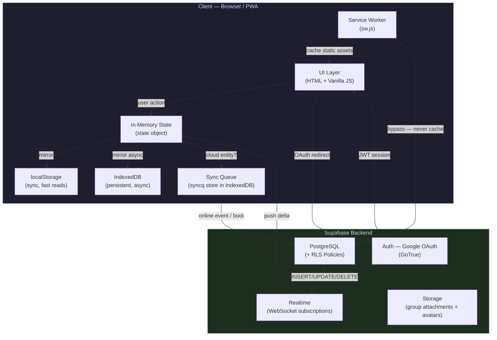
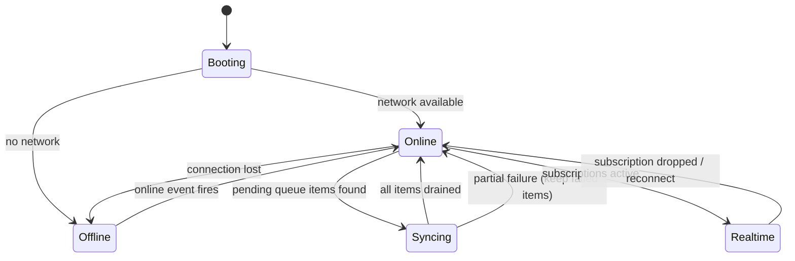
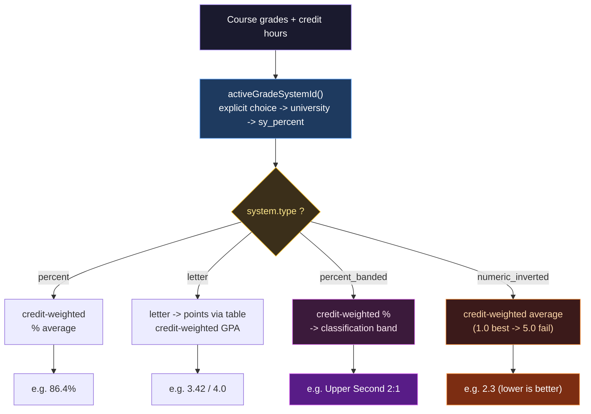

# UniManager — Architecture Deep Dive

> A technical internals guide covering the sync engine, offline-first model, conflict resolution, the GPA computation engine, RLS policies and the recursion trap behind them, the threat model, and the trade-offs I'd defend (and the ones I'd revisit). Written by the developer, for any engineer — or future me — who needs to understand *why* things are built the way they are.

---

## Table of Contents

1. [Project Overview](#1-project-overview)
2. [System Architecture Diagram](#2-system-architecture-diagram)
3. [Tech Stack](#3-tech-stack)
4. [Why Supabase?](#4-why-supabase)
5. [Sync Queue — How It Actually Works](#5-sync-queue--how-it-actually-works)
6. [Conflict Resolution — The Shared Exam Scenario](#6-conflict-resolution--the-shared-exam-scenario)
7. [RLS & The Recursion Trap](#7-rls--the-recursion-trap)
8. [Security Threat Model](#8-security-threat-model)
9. [The GPA Engine](#9-the-gpa-engine)
10. [Scale Boundaries](#10-scale-boundaries)
11. [Trade-offs & What I'd Revisit](#11-trade-offs--what-id-revisit)
12. [What I Learned](#12-what-i-learned)
13. [Useful Links](#13-useful-links)

---

## 1. Project Overview

**UniManager** is a Progressive Web App (PWA) built to solve a real problem: managing university life — schedules, grades, attendance, group coordination, and a shared chat — in a single installable app that works offline.

| Property | Value |
|---|---|
| Type | Single-file PWA (monolith, by design) |
| Codebase | ~7,500 lines, `index.html` |
| Backend | Supabase (PostgreSQL + Auth + Realtime + Storage) |
| Offline | Full offline support via IndexedDB + Service Worker |
| Auth | Supabase Auth — **Google OAuth** (`flowType: 'implicit'`) |
| Deployment | **Cloudflare Pages** (static hosting) |
| Android | Trusted Web Activity (TWA) via PWABuilder — `app.unimanager.twa` |
| Observability | Sentry (browser SDK, PII scrubbed) |
| Developer | Mohamed Hassan — CS / Computer Engineering student, AASTMT |

### Data-Flow Model

Every state mutation follows a strict three-step path:

1. **Local-first write** → the in-memory `state` object is updated immediately, then mirrored to `localStorage` (synchronous) and IndexedDB (async).
2. **Queue or sync** → if the mutation belongs to a cloud-synced entity (group message, exam, attendance), it is enqueued. The queue drains immediately if the network is available; otherwise it retries on the next `online` event or app boot.
3. **Realtime merge** → Supabase Realtime subscriptions push other users' changes into the same `state` object via the same code path. The UI has no concept of *where* a change came from — it just re-renders.

### Project Structure

```
unimanager/
├── index.html                       # The entire app — HTML, CSS, JavaScript (~7,500 lines)
├── sw.js                            # Service Worker: stale-while-revalidate static, bypass for Supabase
├── manifest.json                    # PWA manifest (theme, icons, display: standalone)
├── unimanager_database_schema.sql   # Tables + RLS + universities seed
│                                    #   (RPC bodies + storage policies live only in Supabase)
├── icons/                           # PWA icons + iOS splash screens
├── .github/
│   └── workflows/                   # CI: version-lockstep check, Lighthouse, deploy
└── docs/
    ├── ARCHITECTURE.md              # This document
    └── screenshots/
```

---

## 2. System Architecture Diagram



### Offline State Machine



---

## 3. Tech Stack

### Frontend

| Layer | Choice | Reason |
|---|---|---|
| Language | Vanilla JavaScript (ES2022) | No build step; PWA served as static HTML |
| Styling | CSS custom properties | Zero dependencies; every token flows from `:root`, theme switch is one attribute toggle |
| Offline storage | IndexedDB (raw API, custom `IDB` wrapper) | Persistent, async, handles structured data + the sync queue |
| Fast reads | `localStorage` | Synchronous; used for state hydration on boot |
| PWA runtime | Service Worker (`sw.js`) | Stale-while-revalidate for static assets; explicit **bypass** for Supabase requests (never cached) |
| PWA manifest | `manifest.json` | Enables install / "Add to Home Screen", standalone display |
| i18n | `LL` object (`en` / `ar`) | Every string in one place; `t()` warns once per missing key so EN↔AR parity can't silently drift |

### Backend (Supabase)

| Service | Usage |
|---|---|
| PostgreSQL | Primary database — schedules, grades, attendance, groups, chat, universities catalog |
| Row-Level Security (RLS) | Authorization layer — enforced at the DB level, not the app level |
| Supabase Auth (GoTrue) | **Google OAuth** sign-in, JWT sessions persisted across reloads |
| Supabase Realtime | WebSocket subscriptions for live group chat and shared-group sync |
| Supabase Storage | **Shipped** — two buckets: `group-attachments` (chat files) and `avatars` (profile / group pictures) |
| RPC Functions | Atomic group operations: `create_group`, `join_group_by_code`, `kick_group_member`, `rotate_group_invite_code`, and more (11 total) |

### Tooling & CI/CD

| Tool | Role |
|---|---|
| GitHub Actions | CI: version-lockstep check (`APP_VERSION` ↔ `CACHE_VERSION`), Lighthouse budget, deploy |
| Lighthouse CI | Performance / accessibility / PWA scores on push |
| Sentry | Runtime error tracking, initialized before the main script so early crashes are captured; PII scrubbed |
| PWABuilder | Wraps the PWA into the Android TWA package (`app.unimanager.twa`) |

---

## 4. Why Supabase?

This wasn't a "free and easy" decision. It rests on three pillars.

### Pillar 1 — Relational data first

A university app handling schedules, courses, attendance, and grades is *inherently relational*. I need JOINs to fetch a student with their courses, grades, and attendance in a single query. Firebase (Firestore) is NoSQL — it would have forced me into either denormalization or multiple round-trips to do what PostgreSQL does in one statement.

### Pillar 2 — Firebase pricing is a liability

Firebase's pay-as-you-go model is dangerous for a student project that might grow fast: a single misbehaving loop or unoptimized query can produce a frightening bill. Supabase's predictable pricing — even on the free tier — removes that risk class entirely.

### Pillar 3 — Future control

Supabase is built on open-source tech (PostgreSQL, GoTrue). If I ever need to self-host, I can export the whole database with one command — it's standard Postgres. Firestore offers no comparable exit. I didn't seriously evaluate PocketBase because Supabase bundles Realtime, Auth, and Storage without my having to run a server.

---

## 5. Sync Queue — How It Actually Works

**Scenario: a user mutates data (sends a message, edits an exam) while offline.**

The queue is deliberately simple. There is no exponential backoff, no priority lanes, no dedup logic — and that simplicity is the point. Here is the *actual* mechanism, not an idealized one.

### The store

The queue lives in an IndexedDB object store created with an auto-incrementing key:

```js
d.createObjectStore('syncq', { keyPath: 'qid', autoIncrement: true });
```

That `autoIncrement` is what guarantees FIFO ordering for free — `qid` rises monotonically, and `getAll()` returns rows in key order. I don't track ordering myself; the store does.

### Step 1 — every mutation checks the network first

Each write method follows the same shape. If offline, it enqueues an operation descriptor and returns — the in-memory/localStorage write has *already* happened, so the UI is correct regardless:

```js
if (!_online) { IDB.queuePush({ op: 'upsertExam', row }).catch(() => {}); return; }
```

`queuePush` stamps each op with `ts: Date.now()` (useful for debugging; ordering still relies on `qid`, not the timestamp).

### Step 2 — reconnection fires the drain

`_online` is flipped by the browser's connectivity events, and the `online` event also kicks off a drain:

```js
window.addEventListener('online', () => { _online = true; _updateDot(); _processSyncQueue(); });
```

### Step 3 — FIFO drain

`_processSyncQueue` reads the whole queue with `queueAll()` and replays each operation against Supabase in key order. On success, the item is removed with `queueDel(qid)`.

### Step 4 — failure handling

If an operation fails mid-drain, the error is logged and **the item stays in the queue** (it's never `queueDel`'d), so the next `online` event or boot retries it. Critically, a single failure does **not** block the rest of the queue:

```
[qid 1] upsertExam   → ✅ sent → queueDel(1)
[qid 2] insertSession → ❌ failed → stays (retried next drain)
[qid 3] upsertTask    → ✅ sent → queueDel(3)
                        ↑ drain continues regardless
```

This is "retry on next connectivity event," not timed backoff. For the actual usage pattern — a handful of queued ops after a Wi-Fi blip — it's sufficient and predictable. The honest limitation: an op that fails *deterministically* (e.g. a row the server will always reject) sits in the queue retrying forever. There's no dead-letter handling yet (see §11).

---

## 6. Conflict Resolution — The Shared Exam Scenario

**Scenario: two admins edit the same shared exam at nearly the same time.**

### Who wins?

UniManager uses **Last-Write-Wins (LWW)**, implemented through Postgres `upsert`. There is no single conflict key — each table upserts on the natural key that defines a logical row. The actual `onConflict` targets in the code are:

| Entity | `onConflict` target |
|---|---|
| Personal tasks / exams / subjects | `user_id,local_id` |
| User settings (single row per user) | `user_id` |
| Group shared schedule slot | `group_id,day,slot_key` |
| Group shared exam | `group_id,local_id` |
| Group subject note | `group_id,subject_name` |

So for a shared exam, two admins editing the row identified by `(group_id, local_id)` both issue an upsert; the **last write to reach the server overwrites the earlier one**. No merge, no warning.

### Is the update instant for everyone?

Yes. Realtime subscriptions propagate the winning row to all subscribed clients within milliseconds, so every admin converges on the same final state.

### The offline-vs-online edge case

| Order (wall clock) | Event |
|---|---|
| 1 | user A edits the exam **while offline** (queued) |
| 2 | user B edits the same exam **online** (lands immediately) |
| 3 | user A reconnects → queue drains → A's write lands |
| **Winner** | **user A** |

User A wins despite editing *earlier* in real time, because their write physically reached the server last. User B's edit is silently lost. This is the accepted trade-off of LWW.

### Why LWW and not something smarter?

CRDTs or operational transforms for a student MVP would be massive over-engineering. Shared exams are rarely edited by two people in the same few seconds. LWW is simple, predictable, and correct for the real workload. A timestamp-based "your change was overwritten" notice is the realistic v-next improvement, not full conflict-free replication.

---

## 7. RLS & The Recursion Trap

This is the bug that taught me the most about Postgres RLS, so it gets its own section.

### The goal

Group data should be readable only by members. The natural way to express "is this user a member of this group?" is to check the `group_members` table. So the first instinct for the policy on `group_members` itself is:

```sql
-- ❌ naive: policy on group_members that queries group_members
create policy gm_select_member on group_members
  for select using (
    exists (select 1 from group_members m
            where m.group_id = group_members.group_id
              and m.user_id = auth.uid())
  );
```

### Why it explodes

To evaluate the `SELECT` on `group_members`, Postgres applies the policy. The policy's `USING` clause itself runs a `SELECT` on `group_members` — which triggers the same policy again — which runs the sub-query again. **Infinite recursion.** Postgres aborts with a recursion error; nothing reads at all.


### The fix — `SECURITY DEFINER` helpers

The membership check is moved into a `SECURITY DEFINER` function. Such a function executes with the privileges of its *owner*, not the calling user — so its internal read of `group_members` is **not** subject to the caller's RLS, and the loop never forms:

```sql
create or replace function public.is_group_member(gid uuid)
returns boolean language sql security definer stable
set search_path = public as $$
  select exists(
    select 1 from group_members
    where group_id = gid and user_id = auth.uid()
  );
$$;
```

The policies then call the helper instead of inlining the sub-query:

```sql
create policy gm_select_member on group_members
  for select to authenticated
  using (is_group_member(group_id));
```

A sibling `is_group_admin(gid)` does the same with an added `role = 'admin'` check, and the write policies on shared tables use it (`USING is_group_admin(group_id) WITH CHECK is_group_admin(group_id)`).

Two details that matter for safety: `set search_path = public` prevents a search-path hijack of a `SECURITY DEFINER` function, and `stable` lets the planner cache the result within a statement instead of re-running it per row.

---

## 8. Security Threat Model

RLS is the backbone: **all authorization lives at the database layer**, so even a bug in the JavaScript can't grant access the database doesn't allow. The `SECURITY DEFINER` helpers from §7 are what make those policies both correct and non-recursive.

### Threats intentionally blocked

| Threat | Defense |
|---|---|
| Member (or admin) kicking another admin | `kick_group_member` RPC checks `is_group_admin` and protects admins from each other before mutating the roster |
| Reading a group's chat without membership | `msg_select_member` policy gates reads on `is_group_member(group_id)`; non-members receive nothing, and Realtime is filtered by `group_id` |
| Viewing group data after being kicked | Every read re-checks `group_members` via the helper, so a kicked user loses access on the next request — no cached grant |
| Posting as someone else | `msg_insert_own` requires `sender_id = auth.uid()` **and** `is_group_member(group_id)` in the `WITH CHECK` |
| Editing/deleting others' messages | `msg_update_own_or_admin` allows it only for the original sender or a group admin |
| XSS via chat / user input | `escapeHTML` sanitizes before DOM insertion; CSP blocks unauthorized script origins |
| Joining a group without a valid code | `join_group_by_code` validates the invite code server-side before inserting membership |

### Known trade-offs in v1

**No CSRF tokens.** The app relies on RLS plus standard CORS, and as a token-based-auth PWA with minimal cookie usage the CSRF surface is small. Risk accepted for v1.

**No rate limiting.** A user can spam messages without throttling — an application-level DoS vector. The intended mitigation is Supabase Edge Function rate limiting per user/group, deferred past v1.

---

## 9. The GPA Engine

The single most interesting subsystem, and the one I'd most want to whiteboard in an interview. Most student GPA apps hard-code one grading scale. UniManager's grading is **config-driven** and handles four fundamentally different *types* of computation — because grading systems across countries differ not just in numbers, but in *what a result even is*.

### One config object drives everything

`GRADE_SYSTEMS` defines every supported system; `calcGPA` / `renderGPA` read it. Adding a country is a data change, not a code change. The four `type`s:

| `type` | Input | Output | Systems |
|---|---|---|---|
| `percent` | score 0–100 | credit-weighted % average | `sy_percent` |
| `letter` | a letter from the system's table | credit-weighted GPA points | `us_4`, `us_4_3`, `us_4_unweighted`, `tr_4` |
| `percent_banded` | a percentage | a **degree classification** | `uk_honours` |
| `numeric_inverted` | a number 1.0–5.0 | credit-weighted average, **lower is better** | `de_1_5` |



### Why the last two types are the hard part

The `percent` and `letter` types are conventional credit-weighted averages. The other two break assumptions baked into the rest of the app:

- **`percent_banded` (UK Honours)** doesn't yield a number you compare directly — it yields a *classification band*. The engine computes the credit-weighted average percentage, then maps it through a `bands` table (`≥70 First`, `≥60 2:1`, `≥50 2:2`, `≥40 Third`, else Fail), showing the numeric average alongside the label for transparency. This is the **simplified** model: it deliberately omits per-institution year-weightings, which vary too much to generalize.
- **`numeric_inverted` (German 1–5)** inverts the ordering: 1.0 is best, 4.0 is the lowest pass, 5.0 is a fail. Every "higher is better" assumption — sorting, pass checks, the result label — has to flip for this one system.

### Resolution precedence

Which system is active is decided by `activeGradeSystemId()`, a small precedence chain: an explicit `state.gradeSystem` wins; otherwise it's derived from the selected university's `grade_system`; otherwise it falls back to `sy_percent`. The legacy single-scale helpers (`LG`, `l2g`, `getLG`, `s2g`, `isPassing`) survive as thin wrappers over the new engine so pre-refactor saved semesters still render — with null-safety added after a `toFixed`-of-null crash on old data.

---

## 10. Scale Boundaries

Honest estimates for v1. No hand-waving — and not load-tested.

| Metric | v1 limit | Notes |
|---|---|---|
| Users per group | ~50 | Member list and chat UI designed around this number |
| Daily messages per group | 200–500 | Estimate for an active 50-person group |
| Chat history loaded | Recent messages only | Capped for performance; no auto-archiving / pagination yet |
| Total concurrent users | 10–50 | MVP scope — one semester, a few friend groups |
| Simultaneous WebSocket connections | Supabase free-tier limits apply | Not stress-tested |

v1 is an MVP, not a product launch. It is intentionally not built or tested for thousands of concurrent users.

---

## 11. Trade-offs & What I'd Revisit

I want to be precise here, because "what would you change?" is an interview question and the honest answer isn't "everything."

### The single-file architecture was the right call — for the constraint

UniManager targets phones with weak CPUs and unreliable mobile data. A single file parses faster than a bundled, code-split app on that hardware, and — this is the part that's easy to miss — the Service Worker can cache the entire app shell **atomically**. There is no window where a new `index.html` is paired with a stale JS chunk, because there are no separate chunks. No hydration mismatch, no partial-update bug, no toolchain to break in CI. For the target device, that's a feature, not a compromise.

### Where the trade-off starts to hurt

It's not free, and I won't pretend it is:

- Navigating ~7,500 lines means `Ctrl+F` on banner comments, not jumping between files.
- A careless edit can affect distant code, because everything shares one scope.
- AI-assisted iteration means re-sending a large file for context each time, which is slow and lossy.

The cost is real once the file grows past a certain size. The mistake would be reacting to that pain with a *full rewrite*.

### What I'd actually do — selective extraction, not a rewrite

Rewrites are where projects go to die: months of reimplementing working behavior with no user-visible gain, while the old bugs you'd already fixed quietly reappear. The disciplined move is surgical:

- **Extract the sync queue + state layer into a typed, independently testable module.** This is the one part where immutable, type-checked state would genuinely reduce bugs — the failure-handling edge cases (§5) are exactly where types pay off. Everything else stays as-is until there's a concrete, specific reason to touch it.
- **Add a dead-letter path** so a deterministically-failing op stops retrying forever and surfaces to the user.
- **Conflict resolution:** keep LWW, but add a "your edit was overwritten" notice driven by comparing timestamps on Realtime updates (cheap, high value) before considering anything heavier.

The current single-file build stays the production target for the low-end devices it was designed for. Extraction happens behind it, module by module, only where it earns its keep.

---

## 12. What I Learned

### Technical

- **Offline-first is an architecture decision, not a feature.** It has to be baked in from day one; retrofitting it is painful. Starting every feature from "what if this never reaches the server?" made even the online path simpler.
- **RLS at the database layer beats app-level checks** — write the permission once in SQL and every client gets it for free. But beware recursion: a policy that queries its own table loops forever, and `SECURITY DEFINER` helpers are the escape hatch (§7).
- **Optimistic UI + a FIFO sync queue is a solid offline pattern.** The complexity is entirely in the failure edge cases, not the happy path.
- **Modeling beats hard-coding.** The GPA engine became a four-type modeling problem, and the version that handles UK classifications and the inverted German scale is barely more code than a naive one-scale calculator — because the data drives the behavior.
- **Service Worker lifecycle is subtle.** A cached SW serves a stale `index.html` for days if you don't bump the cache key; the CI version-lockstep check exists because I got burned.

### Process

- **Docs from day one pay for themselves.** The time spent on this document and the README is recovered the moment someone new — or future me — touches the code.
- **CI/CD on a student project is not overkill.** Catching a broken build before it reaches `main` is always worth the setup.
- **"What would you change?" deserves a precise answer.** Knowing *which* part to refactor — and which to leave alone — is a more valuable signal than a willingness to rewrite everything.

---

## 13. Useful Links

| Resource | URL |
|---|---|
| Repository | https://github.com/andrewleko19-boop/unimanager |
| Live App | https://unimanager-sy.pages.dev/ |
| Supabase Docs | https://supabase.com/docs |
| PWA Checklist | https://web.dev/pwa-checklist/ |
| RLS Guide | https://supabase.com/docs/guides/database/postgres/row-level-security |
| `SECURITY DEFINER` & recursion | https://supabase.com/docs/guides/database/postgres/row-level-security#use-security-definer-functions |

---

*Last updated: June 2026 — Mohamed Hassan, CS / Computer Engineering student at AASTMT*
